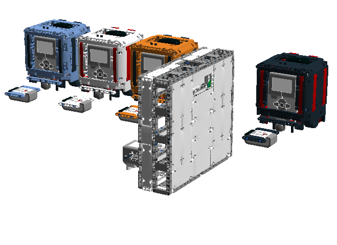

COLOR CATCH3R is a fast-paced multiplayer game. The object of the game is to be the first to get to a randomly selected color. The person that collects five colors wins.

The game is played using the Infrared Beacon. Players control their own robot. A master controller robot will pick the color and display it on a game board. The robots are all connected together and the master controller keeps track of the score and announces the winner in each round.  You can see the game being played here: https://youtu.be/XFAwqX4fy-M.

COLOR CATCH3R V.1 was made in April 2017 for Innovation Faire in St.Louis.  In this version, the robot players were made using NXT motors. The LDD file and list of parts is provided. In addition to the three players, there was a referee robot (JAVI3R) as well as a game board that indicated the next color. JAVI3R has both an EV3 and a Raspberry Pi inside.

COLOR CATCH3R V.2 was made in November 2017 for WRO Costa Rica and uses EV3 motors and wheels from the EV3 Core Set which are more easily available. It uses a game controller EV3 to randomly pick the color as well as keep score.
