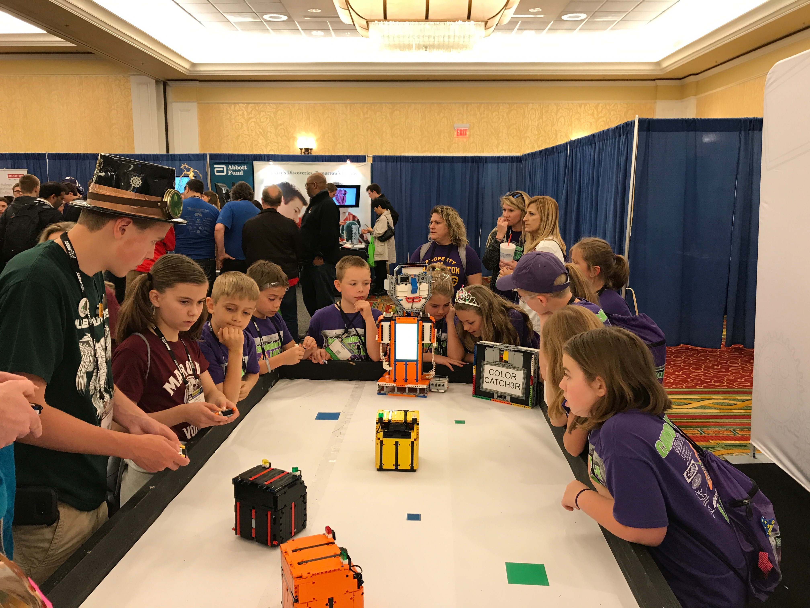

COLOR CATCH3R is a multiplayer game with LEGO MINDSTORMS.

COLOR CATCH3R V.1 was made for Innovation Faire in St.Louis.  In this version, the robot players were made using NXT motors. The LDD file and list of parts is provided. In addition to the three players, there was a referee robot (JAVI3R) as well as a game board that indicated the next color. JAVI3R has both an EV3 and a Raspberry Pi inside.

COLOR CATCH3R V.2 uses EV3 motors and wheels from the EV3 Core Set which are more easily available.
