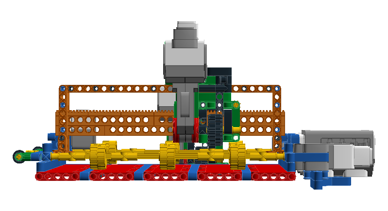
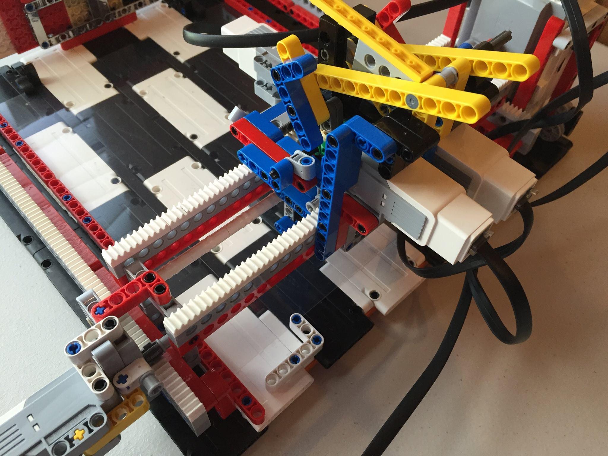
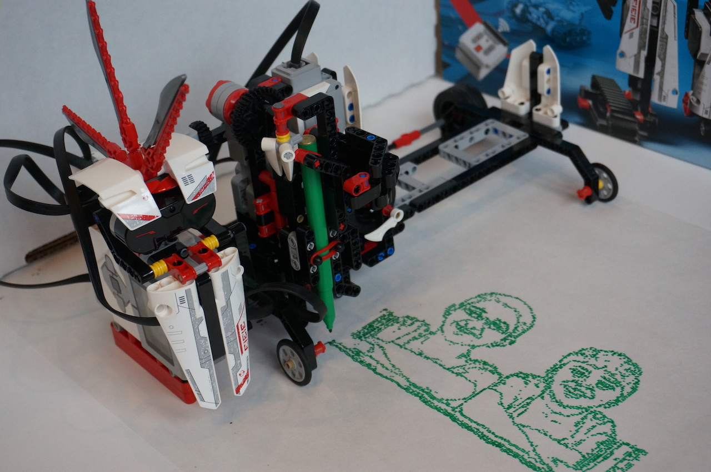

# PIX3L PLOTT3R
You are welcome to reproduce or improve on any of these project for your own, non-commercial use.  Please credit Sanjay and Arvind Seshan for the original design and code.

Follow this project on Facebook: @PIX3LPLOTT3R

PIX3L PLOTT3R is a series of printing robots made with LEGO MINDSTORMS EV3s. Different versions provide different features. Some feature a paper feeder, some feature LEGO markers, some feature multiple EV3s working together and some can even be built with just one set. Each version has a different print mechanism. We will share the project build and code files for each version here. Build the one that best fits your needs or build them all!

**PIX3L PLOTT3R V.2.0 - EV3-Dev Edition:** This version of the plotter is programmed entirely in Python. <a href="https://youtu.be/ovv3BeC4fmI">YouTube Video</a>. 

**PIX3L PLOTT3R V.3.0:** This version has a paper feeder and uses regular, fine line markers. The original version of this plotter was programmed in Python. However, the version shared in this folder is programmed in EV3-G.  <a href="https://youtu.be/4uXEJy2_22A">YouTube Video</a>.  

**PIX3L PLOTT3R 4.0:** In this version of the plotter, the paper does not feed. It uses up to two LEGO Markers. This version of the ploter was originally programmed in Python, but has been converted to EV3-G. A variation of this plott3r is used as a photo booth and can bring images taken with with a webcam and Raspberry Pi. (Instructions coming soon) Watch this <a href="https://youtu.be/BFtARiJcW8w">YouTube Video of V.4</a>.  Watch this YouTube video to see <a href="https://www.youtube.com/watch?v=ojMbPc9EGgU">Photo Booth Features</a> 

**SCRIB3 - PIX3L PLOTT3R Home Edition:** This version of the plotter is made with a single LEGO MINDSTORMS 31313 set. Instructions and code are coming soon.

**Holiday Card Plott3r -  PIX3L PLOTT3R Christmas Edition:** This is a special edition of PIX3L PLOTT3R that requires three LEGO MINDSTORMS EV3s working together. To see this plotter in action, watch the
 <a href="https://youtu.be/XGDPLqzy6EA">YouTube Video by the LEGO Group</a>. Instructions coming soon.

Image Credit: The LEGO Group

