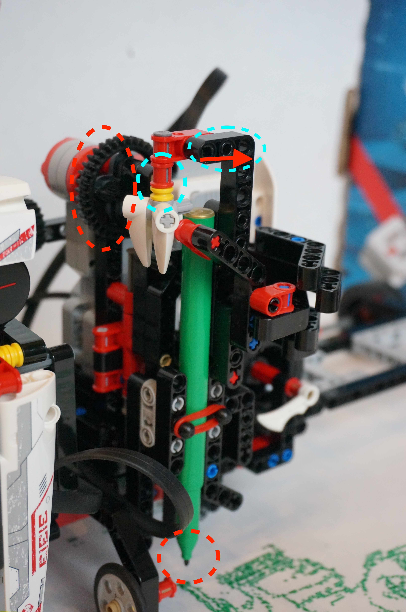
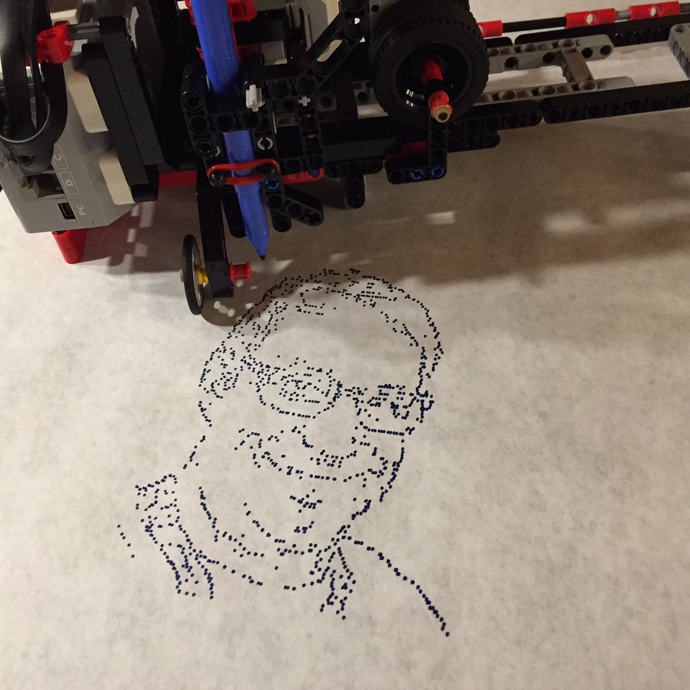
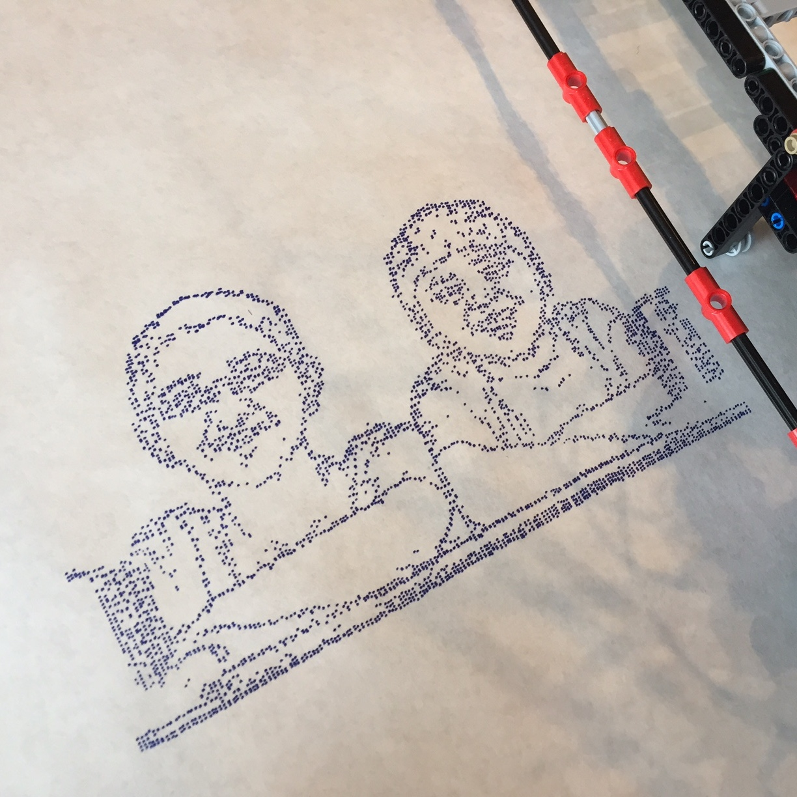
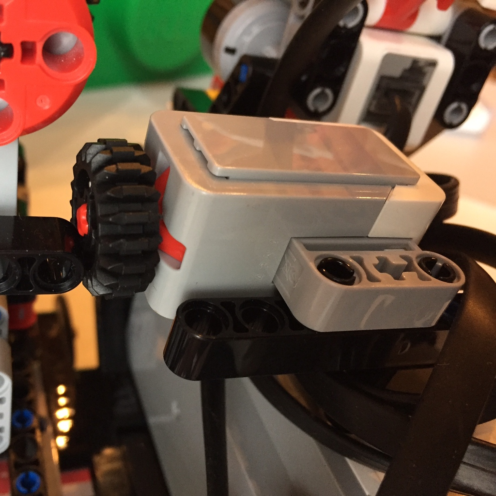
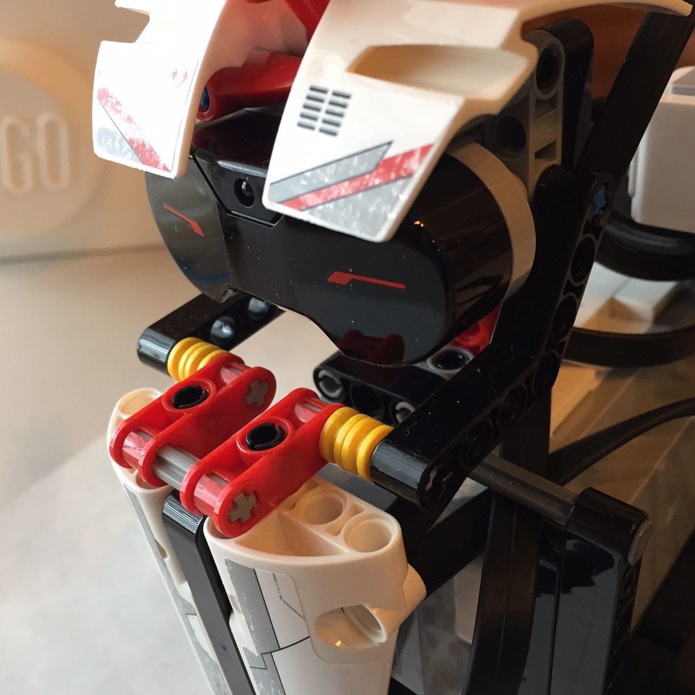
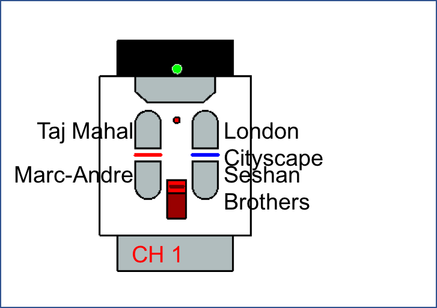

This version of PIX3L PLOTT3R is made with just one 31313 set. Watch this <a href="https://youtu.be/kFiWumBILwU">YouTube Video</a> to see the robot in action before you begin.

**Step 1: Build Model** <a href="https://github.com/seshanbrothers/projects/blob/master/PIX3LPLOTT3R/SCRIB3/SCRIB3v1.lxf?raw=true">Use the .lxf file</a> available in this GitHub repository to build the model. Separate building instructions are not provided at this time. You will have to <a href="http://ldd.lego.com/en-us/download">download and install LEGO Digital Designer</a> (a free software from LEGO) to view the .lxf file. Also included is a <a href="https://github.com/seshanbrothers/projects/tree/master/PIX3LPLOTT3R/SCRIB3/RobotPhotos">folder of photos of the robot</a> so you can check your build.

Wiring: Medium Motor (Port A), Large Motor Controlling Pen (Port B), Larage Motor Controlling Wheels (Port C), Touch Sensor (Port 1), and Infrared (Port 4), . Use the longer wires for B (35cm) and C (50cm) motor connections.

**Step 2: Get Paper** Tape a large piece of paper down on a hard surface. This will ensure that the paper does not move as the robot drives across. We prefer to use paper as wide as the robot.

**Step 3: Add Pen to Pen Holder** Insert pen as shown and secure with LEGO rubberband from your 31313 set. Adjust the pen holder's height (light green circles) by removing extra LEGO pieces or moving the top of the holder to the right as needed for your particular pen. SCRIB3 has been designed for narrower-style markers, but can accomodate both taller markers (Prang, Crayola) or shorter ones (Faber-Castel). You will know that you pen is in the right location if you can turn the gear (marked in red) by hand and the pen nib just touches the paper and leaves a dot. Test in one corner of your paper or on a scrap paper before running the program.

**Step 4: Adjust Code** Download the  <a href="https://github.com/seshanbrothers/projects/blob/master/PIX3LPLOTT3R/SCRIB3/SCRIB3v1.ev3?raw=true">.ev3 file </a> on this GitHub page to your computer. Download the <a href="https://github.com/seshanbrothers/projects/blob/master/PIX3LPLOTT3R/SCRIB3/prints/Print%20Images.zip?raw=true"> zipped file of the four .rtfs</a> in the "prints" folder on this GitHub page to your computer. Unzip the zipped file on your computer and you will have the 4 images you can print. We have created different images (.rtf files) for you can choose from. Note: Pick the zipped file in the prints folder as this will be easier for you to download. We have set up the code to have four images at a time. Four default images are provided: Taj Mahal, Marc-Andre Bazergui Portrait, London Cityscape (long, banner-style image will require a long piece of paper), and Seshan Brothers Portrait. We have provide a few photos below so you can compare your prints with ours. You can either print one of those four, or upload your own images (as .rtf files) and modify the code.  Note: To create alternative images in a format that is recognized by the EV3, you will have to run a small <a href="https://github.com/seshanbrothers/projects/blob/master/PIX3LPLOTT3R/image2ev3rtf.py">Python Script</a>.

**Step 5: Download the EV3 Code and the Images to your EV3** First, download the .EV3 file to your EV3 brick. Next, upload the four images (.rtf files) to your brick. Upload them to the SCRIB3v1 folder on the EV3 brick. If you do not know how to do this, you will need to complete a <a href="http://ev3lessons.com/translations/en-us/advanced/DownloadUploadFiles.pdf">lesson on Downloading and Uploading Files</a>.

**Step 6: Start Printing** On your EV3 brick, run the SCRIB3 Program. Place SCRIB3 such that the print area will always be on the paper (as it moves across). Make sure that the printer head (the part that holds the pen is moved to the far left, closest to the brick, so that the touch sensor is pressed. Now use the IR Beacon Remote buttons to pick the images. Each button corresponds to an image (you can see comments in the code to know which button is for which image).

