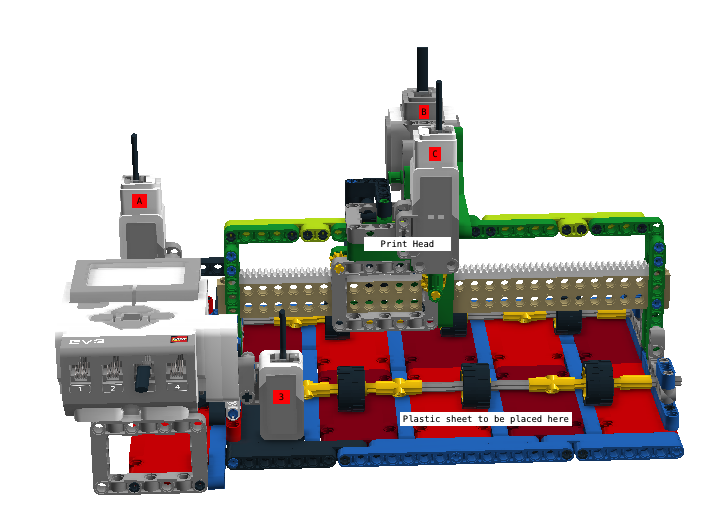
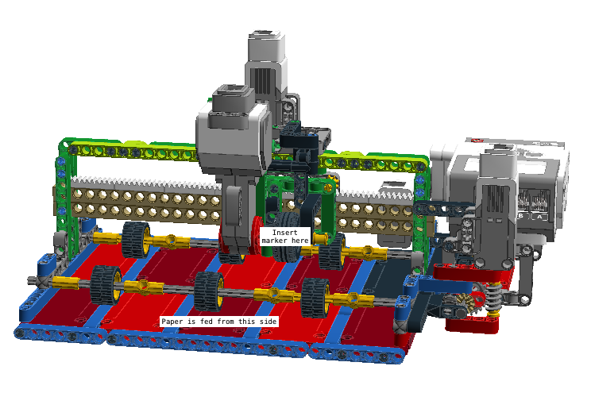

# PIX3L PLOTT3R V.3.0

You are welcome to reproduce or improve upon this project for your own, non-commercial use.  Please credit Sanjay and Arvind Seshan for the original design and code. You are encouraged to share your work back with Sanjay and Arvind as well. We would enjoy seeing all the different versions of the printer.

# Version 3.0 Features
1. Uses wheels to feed in paper
2. Uses regular, thin markers (e.g. Crayola, Prang, or equivalent fine line marker)
3. Programmed in EV3-G
4. Additional images processed in Python (if neeeded)
5. Parts needed: 1 EV3 brick, 2 medium motors, 1 large motor, 1 color sensor, extra Technic and System parts. You can order parts from a store such as Bricklink.
6. This robot has been designed for US Letter size paper. You will have to make modifications if your paper is different.
7. We recommend that you place a clear plastic sheet on top of the plates for the paper to rest on. 

# Installation Steps

**STEP 1:** Build the robot. Although there are no build instructions provided, you can use the LDD file to duplicate this design. Use the hide and reveal features as needed. You will notice that there is a dark plate under the color sensor. This is deliberate. Place a clear plastic sheet on top of the plates. Tape the plastic sheet down at one end (where the color sensor is located). This will prevent the paper from catching on the holes in the LEGO as it moves forward.

Color Sensor - Port 3, Paper Feeder Medium Motor - Port A, Printer Head Large Motor - Port B, Printer Head Medium Motor - Port C
 

**STEP 2:** Select the images you want the plotter to print. We have provided four images (.rtf files) to choose from. You can make your own as well (see Step 6). 

**STEP 3:** Modify the EV3-G code to match the images. In the EV3-G program, rename the very first two constant blocks "file1" and "file2" to match the two .rtf files you selected to print. (For example, change "file1" to "Taj" if you want a Taj Mahal printed).

**STEP 4:** Download the .ev3 file and the .rtf files to the brick. (If you don't know how to do that, refer to EV3Lessons.com Lessons -> Advanced for a lesson on Downloading and Uplaoding Files)

**STEP 5:** Start the printing process. Insert a marker in the print head slightly above the paper (should not touch the LEGO plates). There is a menu system that displays on the brick that lets you pick from the two images and gives you instructions. You can use the left and right brick buttons to preview the image. The printer head starts as far left as possible (close to the brick). It will reset after each print is complete.

**STEP 6:** How do you make more images? We have provided a <a href="https://github.com/seshanbrothers/projects/blob/master/PIX3LPLOTT3R/image2ev3rtf.py">Python Script</a>  that will convert any png to a rtf. The png should be 100 pixels width.

